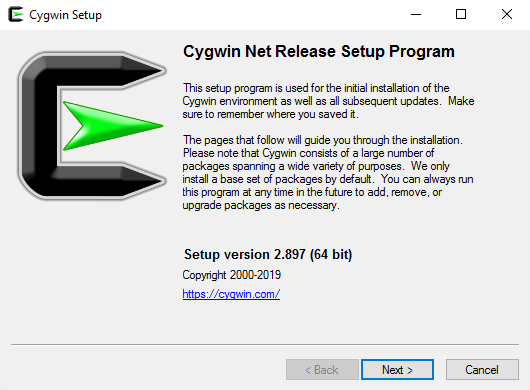
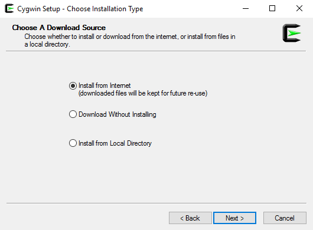
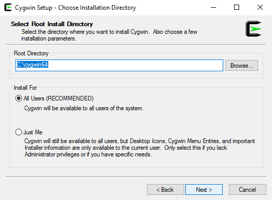
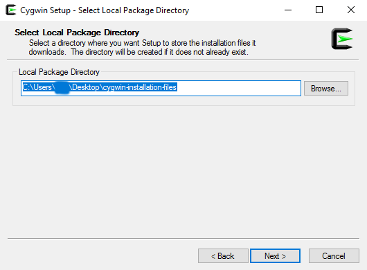
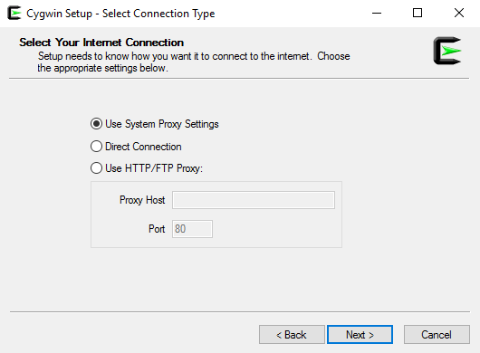
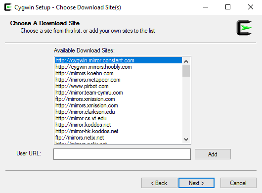
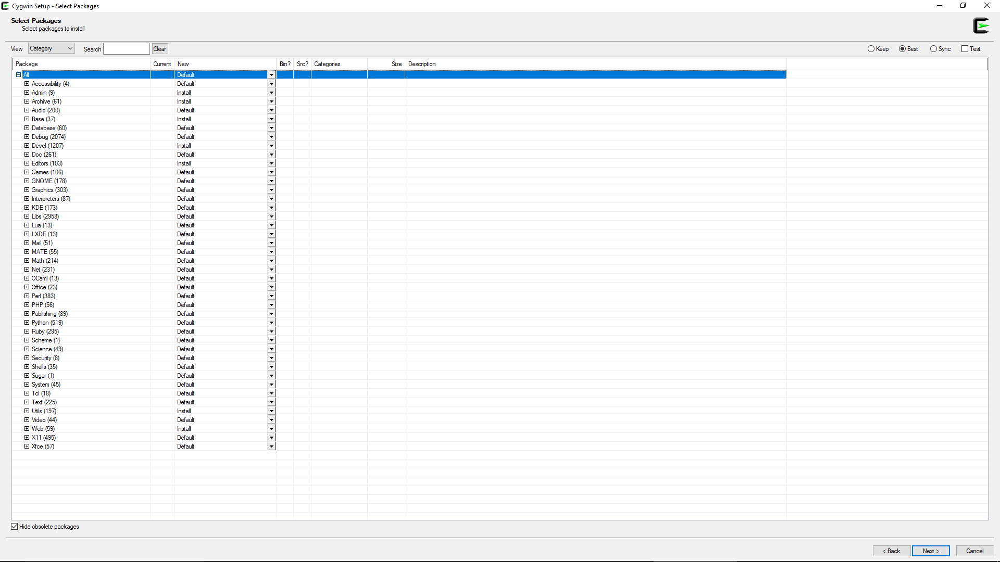
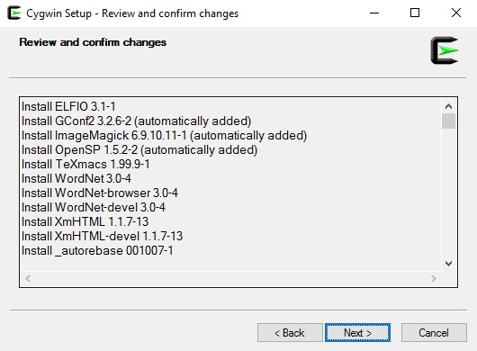
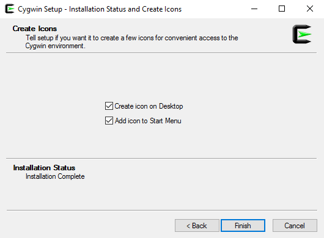

# Installing Cygwin on Windows 10
**Burden**: \~45 minutes

## Before Installation
Cygwin is available in 32- and 64-bit versions. You’ll want to determine if you’re running a 64-bit version of Windows before proceeding. To find out, do the following:
1. Press the Windows key, then type “about”
2. Click “About your PC”
3. Find the value to the item marked “System type”

## Installation
The installation should take about 30 minutes, depending on which mirror you choose in step 9 and network congestion.

1. Visit Cygwin’s [web site](https://cygwin.com/).
2. Find the heading marked “Installing Cygwin”.
3. Choose the 64- or 32-bit version of the `.exe` file and run it.
4. This initial dialog box tells you some important information. For example, you are advised to “remember” where you save the installation files (from a subsequent step). It also says that you run this program if you want to “add, remove, or upgrade packages as necessary.”

5. In this step (“Choose Installation Type”), you have three choices: “Install from Internet”, which downloads the packages into a folder you choose, then runs the installer; “Download Without Installing”, which downloads the packages and does nothing more; and, “Install from Local Directory”, which runs the installer after you direct it to a folder that contains all the packages. Take the default (“Install from Internet”) for an initial installation.

6. In the “Choose Installation Directory”, you choose where to install Cygwin and for which users.

7. The “Select Local Package Directory” step asks you for the directory in which to download Cygwin’s packages. This is the folder you need to “remember,” per the initial Cywgin setup window.

8. In the “Select Connection Type” dialog box, choose the default, which tends to work fine.

9. Now, choose a mirror from where to download the packages. For the fastest download, visit the [Mirror Sites page](https://cygwin.com/mirrors.html) and locate a mirror closest to you.

10. **This next step is important, so read carefully**. From the “Select Packages” dialog box, you need to choose `Admin`, `Archive`, `Base`, `Devel`, `Editors`, `Utils`, and `Web`. This is done by clicking the arrow  to the right of each package entry, then choose “Install”.

11. You can review and confirm the changes in this window. On an initial install, there will be myriad files listed here. However, when carrying out an update, fewer files will appear for review.

12. And, finally, a dialog box asking for the creation of useful shortcuts and confirmation of a successful installation.

You can read more about the installation configuration at [https://www.cygwin.com/cygwin-ug-net/setup-net.html](https://www.cygwin.com/cygwin-ug-net/setup-net.html).

If you’re taking a class with me in which I advise you to install Cygwin, continue reading.

## Configure Your Cygwin Environment
Assuming you installed the 64-bit version of Cygwin, you should now have a Cygwin home folder at `C:\cygwin64\home\USERNAME`, where `USERNAME` is your Cygwin username. **Note**: This is your Cygwin home folder, _not_ your Windows home folder, which should still be at `C:\Users\USERNAME`.

1. Download [https://github.com/code-warrior/web-dev-env-config-files/archive/master.zip](https://github.com/code-warrior/web-dev-env-config-files/archive/master.zip).
2. Context-click, then choose to “Extract All...”
3. Open the folder `web-dev-env-config-files-master` and place it in the top right section of your screen.
4. Open your Cygwin home folder in Windows Explorer by typing `Windows key + R` then, in the text prompt, typing `C:\cygwin64\home\USERNAME`.
5. Place this opened folder in the top left section of your screen.
7. Drag `.editorconfig` from `web-dev-env-config-files-master` on the right to `C:\cygwin64\home\USERNAME` on the left.
8. On the right, open the `terminal` folder then the `git-env-for-mac-and-windows` folder.
9. Move all the files in `git-env-for-mac-and-windows` on the right to `C:\cygwin64\home\USERNAME` on the left.
10. In the right folder, go up to the parent, then open the `windows` folder. Move all the files in the `windows` folder to the left. When you’re presented with the “Replace or Skip Files” dialog box, check “Replace the files in the destination.”
11. Close all the windows.
12. Go to Cygwin and type “exit”.

## Edit `.bash_aliases` and `.bashrc`
* Open Cygwin and type `whoami` to find your exact Cygwin username.
* Open `.bash_aliases`, which is in your Cygwin home folder, then replace `WINDOWS-USERNAME` with your Cygwin username.
* Do the same for the file `.bashrc`, which is also in your Cygin home folder.
